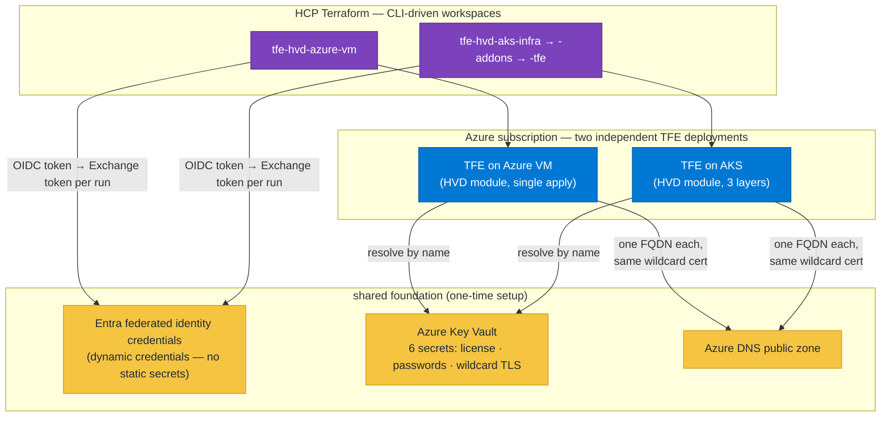

# Terraform Enterprise on Azure

Terraform configurations for deploying HashiCorp Terraform Enterprise (TFE) on Azure two ways — Azure VM and AKS — via the [HashiCorp Validated Design (HVD)](https://developer.hashicorp.com/validated-designs) modules. Two independent deployments of the same product, side by side, in the same Azure subscription — used for learning and demos.

| Deployment | Directory | Module | HCP TF Workspace(s) |
|---|---|---|---|
| TFE on **Azure VM** | [`vm/`](vm/) | [terraform-enterprise-hvd/azurerm](https://registry.terraform.io/modules/hashicorp/terraform-enterprise-hvd/azurerm/latest) `1.0.0` | `tfe-hvd-azure-vm` |
| TFE on **AKS** | [`aks/`](aks/) | [terraform-enterprise-aks-hvd/azurerm](https://registry.terraform.io/modules/hashicorp/terraform-enterprise-aks-hvd/azurerm/latest) `0.2.0` | `tfe-hvd-aks-infra` → `-addons` → `-tfe` |

Every directory is a self-contained, CLI-driven root module with its own HCP Terraform workspace (all in the `jaz-hashi` org, Default Project) and its own state.



See the per-deployment READMEs:

- **[vm/README.md](vm/README.md)** — TFE on an Azure VM with PostgreSQL Flexible Server, Azure Cache for Redis, and Blob Storage; single apply.
- **[aks/README.md](aks/README.md)** — TFE on AKS in three layered workspaces (infra → addons → tfe), DNS via external-dns with Azure Workload Identity.

---

## Repository layout

```
.
├── vm/            # TFE on Azure VM → workspace tfe-hvd-azure-vm (single apply)
├── aks/           # TFE on AKS — three layered workspaces, applied in order:
│   ├── infra/     #   1. tfe-hvd-aks-infra  (VNet, AKS, PostgreSQL, Redis, Storage, external-dns identity)
│   ├── addons/    #   2. tfe-hvd-aks-addons (external-dns with Azure Workload Identity)
│   └── tfe/       #   3. tfe-hvd-aks-tfe    (Kubernetes secrets, TFE Helm chart)
└── scripts/       # shared: create_tfe_secrets.sh (Key Vault bootstrap)
```

The deployments use distinct `friendly_name_prefix` / `tfe_fqdn` values so they coexist in the same subscription, each in its own VNet (VM uses `10.1.0.0/16`, AKS uses `10.0.0.0/16` — separate VNets, no conflict).

---

## Workspace variables

| Workspace | Terraform variables | Env variables |
|---|---|---|
| `tfe-hvd-azure-vm` | `friendly_name_prefix`, `tfe_fqdn`, DNS/Key Vault vars, `allowed_ingress_cidrs`, `vm_ssh_public_key`; `tfe_image_tag` optional | `TFC_AZURE_PROVIDER_AUTH`, `TFC_AZURE_RUN_CLIENT_ID`, `ARM_SUBSCRIPTION_ID`, `ARM_TENANT_ID` |
| `tfe-hvd-aks-infra` | `friendly_name_prefix`, `tfe_fqdn`, DNS/Key Vault vars, `aks_kubernetes_version`, `allowed_ingress_cidrs`; API ranges optional | same four Azure env vars |
| `tfe-hvd-aks-addons` | none (reads infra remote state) | same four Azure env vars |
| `tfe-hvd-aks-tfe` | `tfe_image_tag` optional | same four Azure env vars |

Key Vault secret IDs are **never** workspace variables — configs resolve them by name from `key_vault_name` via data sources.

---

## Setting up from a fresh clone

Everything a new person needs, in order. Steps 1–6 are one-time platform setup; after that each deployment is one command (or three applies).

### 1. What you need before starting

| Thing | Where to get it |
|---|---|
| Azure subscription | confirm the correct subscription ID and that it permits public IPs, AKS, PostgreSQL, Redis, Storage, Key Vault, DNS, identities, and role assignments |
| Bootstrap permissions | Contributor plus Role Based Access Control Administrator (or Owner) at subscription scope; Cloud Application Administrator/Application Developer in Entra ID |
| HCP Terraform organization | [app.terraform.io](https://app.terraform.io) — free tier works |
| TFE license (`.hclic`) | your HashiCorp account team |
| Azure DNS public zone (delegated) | create in the subscription and delegate NS records at your registrar — **must be delegated or DNS will not resolve** |
| CLI tools | `terraform` (>= 1.9), Azure CLI, `openssl`, `jq`, `git`; plus `kubectl` and Helm for AKS; `shellcheck` and `tflint` for local validation |

On this Mac, Azure CLI, ShellCheck, TFLint, and ripgrep were not installed during the repository review. Install at least the deployment tools before continuing:

```sh
brew update
brew install azure-cli jq openssl kubectl helm shellcheck ripgrep
brew install terraform-linters/tap/tflint
az login
az account set --subscription "<sandbox-subscription-id>"
az account show --query '{name:name,id:id,tenantId:tenantId,state:state}' -o table
```

Register and verify all required resource providers. Registration can take several minutes:

```sh
for provider in \
  Microsoft.Authorization Microsoft.Cache Microsoft.ContainerService \
  Microsoft.DBforPostgreSQL Microsoft.KeyVault Microsoft.ManagedIdentity \
  Microsoft.Network Microsoft.OperationalInsights Microsoft.Storage; do
  az provider register --namespace "$provider"
done

az provider list --query "[?contains(['Microsoft.Authorization','Microsoft.Cache','Microsoft.ContainerService','Microsoft.DBforPostgreSQL','Microsoft.KeyVault','Microsoft.ManagedIdentity','Microsoft.Network','Microsoft.OperationalInsights','Microsoft.Storage'], namespace)].{Provider:namespace,State:registrationState}" -o table
```

Before choosing `location` and `aks_kubernetes_version`, verify regional support, restrictions, and quota. The AKS module needs four `Standard_D8ds_v5` nodes by default (two system plus two TFE); the VM module uses `Standard_D4s_v4` by default.

```sh
LOCATION=australiaeast
az aks get-versions --location "$LOCATION" -o table
az vm list-skus --location "$LOCATION" --resource-type virtualMachines --all \
  --query "[?name=='Standard_D4s_v4' || name=='Standard_D8ds_v5'].{SKU:name,Restrictions:restrictions}" -o table
az vm list-usage --location "$LOCATION" -o table
```

Also check Azure Portal quotas for PostgreSQL Flexible Server and Azure Cache for Redis in the selected region. Sandbox subscriptions commonly have low or zero family quota. Request increases before applying.

### 2. Entra ID / OIDC federated credentials for HCP Terraform (one-time)

Every workspace authenticates to Azure via [dynamic credentials](https://developer.hashicorp.com/terraform/cloud-docs/workspaces/dynamic-provider-credentials/azure-configuration) — no static client secrets ever stored.

**AWS vs Azure difference:** AWS IAM trust policies support `StringLike` with wildcards (`organization:*:workspace:*:run_phase:*`), so a single role covers all workspaces. Azure/Entra federated identity credentials do **not** support wildcard subjects — each subject string must be an exact match. You must therefore create one federated credential per workspace per run phase (`plan` and `apply`). The `for_each` below automates this.

<details>
<summary>Copy-paste Terraform for the Entra app + federated credentials (run locally with <code>az login</code>)</summary>

```hcl
# Run this configuration locally, once, with admin Azure credentials.
# It creates an Entra ID application, its service principal, a Contributor
# role assignment (demo-grade — tighten for production), and one federated
# credential per workspace per run phase.

terraform {
  required_providers {
    azurerm = { source = "hashicorp/azurerm", version = "~> 4.0" }
    azuread = { source = "hashicorp/azuread", version = "~> 3.0" }
  }
}

provider "azurerm" { features {} }
provider "azuread" {}

data "azurerm_subscription" "current" {}
data "azuread_client_config" "current" {}

# ---------------------------------------------------------------------------
# Entra ID application + service principal
# ---------------------------------------------------------------------------
resource "azuread_application" "tfc" {
  display_name = "hcp-terraform-tfe-azure"
}

resource "azuread_service_principal" "tfc" {
  client_id = azuread_application.tfc.client_id
}

# Contributor plus RBAC administration on the whole subscription is demo-grade.
# It is needed here because the roots create managed identities and role
# assignments. For production, pre-create resource groups/role assignments and
# replace these broad roles with tested custom roles at narrower scopes.
resource "azurerm_role_assignment" "tfc_contributor" {
  scope                = data.azurerm_subscription.current.id
  role_definition_name = "Contributor"
  principal_id         = azuread_service_principal.tfc.object_id
}

resource "azurerm_role_assignment" "tfc_rbac_admin" {
  scope                = data.azurerm_subscription.current.id
  role_definition_name = "Role Based Access Control Administrator"
  principal_id         = azuread_service_principal.tfc.object_id
}

# ---------------------------------------------------------------------------
# Federated identity credentials — one per workspace per run phase.
# Azure/Entra does NOT support wildcard subjects, unlike AWS IAM trust policies
# that can match organization:*:workspace:*:run_phase:*. Each credential must
# name an exact workspace + phase combination.
# ---------------------------------------------------------------------------
locals {
  hcp_org     = "jaz-hashi"
  hcp_project = "Default Project"
  workspaces  = [
    "tfe-hvd-azure-vm",
    "tfe-hvd-aks-infra",
    "tfe-hvd-aks-addons",
    "tfe-hvd-aks-tfe",
  ]
  run_phases = ["plan", "apply"]

  federated_credentials = {
    for pair in setproduct(local.workspaces, local.run_phases) :
    "${pair[0]}-${pair[1]}" => {
      workspace  = pair[0]
      run_phase  = pair[1]
      subject    = "organization:${local.hcp_org}:project:${local.hcp_project}:workspace:${pair[0]}:run_phase:${pair[1]}"
    }
  }
}

resource "azuread_application_federated_identity_credential" "tfc" {
  for_each = local.federated_credentials

  application_id = azuread_application.tfc.id
  display_name   = each.key
  audiences      = ["api://AzureADTokenExchange"]
  issuer         = "https://app.terraform.io"
  subject        = each.value.subject
}

output "client_id" {
  description = "Set this as TFC_AZURE_RUN_CLIENT_ID in each HCP TF workspace."
  value       = azuread_application.tfc.client_id
}

output "tenant_id" {
  description = "Azure tenant ID (for reference)."
  value       = data.azuread_client_config.current.tenant_id
}

output "subscription_id" {
  description = "Set this as ARM_SUBSCRIPTION_ID in each HCP TF workspace."
  value       = data.azurerm_subscription.current.subscription_id
}
```

</details>

After applying, set these **environment variables** on every workspace (or as a variable set on the project):

| Variable | Value |
|---|---|
| `TFC_AZURE_PROVIDER_AUTH` | `true` |
| `TFC_AZURE_RUN_CLIENT_ID` | `<client_id output from above>` |
| `ARM_SUBSCRIPTION_ID` | target sandbox subscription ID |
| `ARM_TENANT_ID` | Entra tenant ID from the bootstrap output |

### 3. Point the code at your org

- Change `organization` in every `cloud {}` block (`vm/provider.tf`, `aks/*/provider.tf`) and in the `terraform_remote_state` blocks (`aks/addons/data.tf`, `aks/tfe/data.tf`).
- Change the default `location` in each `variables.tf` if you want a different Azure region.

### 4. Create the workspaces

In your HCP TF org: **Projects & workspaces → New workspace → CLI-Driven Workflow** (no VCS connection). Create: `tfe-hvd-azure-vm`, `tfe-hvd-aks-infra`, `tfe-hvd-aks-addons`, `tfe-hvd-aks-tfe`. Then:

- On **every** workspace, set all four env variables from the table above. A project variable set is the simplest approach. These IDs are not secrets.
- Set Terraform variables per the workspace table. For a single public IP, use `curl -4 https://ifconfig.me` and add `/32`; also include all VCS webhook, CI, agent, and user networks that must call TFE. `0.0.0.0/0` is explicitly discouraged.
- Use a different `friendly_name_prefix` for each deployment. It must be 1-17 lowercase alphanumeric characters with no hyphens because the HVD modules include it in a globally unique Azure Storage Account name.
- Set `vm_ssh_public_key` to the contents of an OpenSSH `.pub` file, never the private key.
- Set `aks_kubernetes_version` from the current non-preview versions returned by `az aks get-versions`; the pinned HVD module's built-in `1.29.6` default is retired.
- Keep `aks_api_server_authorized_ip_ranges=[]` only when using HCP Terraform hosted execution. To restrict/private the API, run an HCP Terraform Agent with VNet access and supply the agent/user CIDRs.
- Enable **remote state sharing** on `tfe-hvd-aks-infra` (Settings → General): share with `tfe-hvd-aks-addons` and `tfe-hvd-aks-tfe`.

### 5. Authenticate locally

```sh
terraform login      # HCP Terraform token
az login             # Azure credentials for bootstrap and subscription preflight
az account set --subscription "<sandbox-subscription-id>"
```

### 6. Create the shared TFE secrets (once)

> ⚠️ **Key Vault name uniqueness**: Azure Key Vault names are globally unique across all tenants and at most 24 characters. Choose a unique name (e.g. `tfe-<yourname>-kv`) and ensure the Resource Group exists before running.

```sh
export KEY_VAULT_NAME="tfe-yourname-kv"        # ≤ 24 chars, globally unique
export TFE_HOSTED_ZONE="your-zone.example.com"
export KV_RESOURCE_GROUP="tfe-bootstrap-rg"
export KV_LOCATION="australiaeast"
export TFE_LICENSE_PATH="/path/to/terraform.hclic"
./scripts/create_tfe_secrets.sh
```

For trusted TLS, also export `TLS_CERT_PATH`, `TLS_KEY_PATH`, and `TLS_CA_BUNDLE_PATH`. If all three are omitted, the script generates self-signed sandbox TLS and every browser, VCS, agent, and CLI must trust that private CA manually.

Creates 6 secrets (license, encryption/database passwords, wildcard TLS cert/key/CA) in the Key Vault — see [scripts/README.md](scripts/README.md). After the vault is created, grant the Entra app **Key Vault Secrets User** role on it:

```sh
az role assignment create \
  --assignee "<TFC_AZURE_RUN_CLIENT_ID>" \
  --role "Key Vault Secrets User" \
  --scope "/subscriptions/<sub-id>/resourceGroups/<kv-rg>/providers/Microsoft.KeyVault/vaults/<kv-name>"
```

### 7. Deploy

```sh
# TFE on Azure VM — one apply
cd vm && terraform init && terraform apply

# TFE on AKS — three applies, in order
cd aks/infra  && terraform init && terraform apply   # ~30-40 min (AKS, PostgreSQL, Redis)
cd ../addons  && terraform init && terraform apply   # ~3-5 min
cd ../tfe     && terraform init && terraform apply   # ~10-20 min (image pull, DB migrations, LB)
```

After the tfe layer finishes, external-dns creates the Azure DNS A record from the TFE Service annotation and `https://<tfe_fqdn>` becomes live within a few minutes.

After each apply, verify the actual controls rather than relying on successful Terraform completion:

```sh
curl --fail --show-error "https://<tfe-fqdn>/api/v1/health/readiness"
az network nsg rule list --resource-group <vm-rg> --nsg-name <vm-nsg> -o table
kubectl -n tfe get service terraform-enterprise -o yaml
kubectl -n tfe get pods
```

**Teardown** (order matters for AKS — remove in-cluster resources before deleting the cluster/VNet):

```sh
# AKS
cd aks/tfe    && terraform destroy
cd ../addons  && terraform destroy
cd ../infra   && terraform destroy

# VM (independent — can be destroyed at any time)
cd vm && terraform destroy
```

## Security and production-readiness review

This repository is suitable for a controlled sandbox after the prerequisites and allowlists are set. It is not a complete production platform:

- Both TFE endpoints use public load balancers. CIDR allowlists reduce exposure but do not replace private connectivity, WAF/DDoS design, or an enterprise ingress tier.
- HCP Terraform hosted runs require a public AKS API in this implementation. A production private cluster needs an HCP Terraform Agent with private network reachability and scoped Kubernetes/Entra RBAC.
- AKS Terraform providers use short-lived admin kubeconfig credentials. The run identity therefore has cluster-admin capability during applies.
- Sensitive values exist in encrypted HCP Terraform state and Kubernetes Secrets. Blob Storage uses Workload Identity, so its key is not passed to the app layer, but AzureRM still records generated Storage/Redis keys in infra state; the Redis key, TFE license, database/encryption passwords, and TLS key also remain in the relevant states.
- AKS runs one TFE replica; VM defaults to one instance; PostgreSQL HA is not enabled. There is no tested failover, restore automation, cross-region design, or declared RTO/RPO.
- Monitoring, alerting, diagnostic settings, network policies, Defender, image policy, customer-managed encryption keys, and automated certificate/secret rotation are not implemented.
- The HVD modules are community software without an SLA. AKS HVD `0.2.0` remains on AzureRM v3 and emits an upstream deprecation warning.
- Self-signed TLS is sandbox-only. Use a publicly or enterprise-trusted wildcard certificate for integrations.
- Review Azure Policy, naming, tagging, locks, budgets, Defender, and data-residency requirements with the subscription owner before production use.

Cost varies heavily by region and agreement. The AKS path creates four `Standard_D8ds_v5` nodes by default, PostgreSQL `GP_Standard_D4ds_v4`, Premium Redis, storage/private endpoints, and load balancers. The VM path creates its own database, Redis, storage, VMSS, and load balancer. Use the Azure Pricing Calculator and create a budget alert before applying; destroy in the documented order when the sandbox is idle.